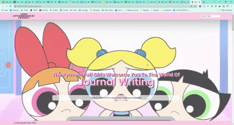

# The Pythonpuff Girls - Journaling Website
 A anonymous journalling website for female coders to share their coding adventures. 
 Users can anonymously write posts and add gifs, comment on other posts, and react with emojis. 

  

## Installation and Usage
- Clone or download the repo.
- Install all dev dependencies using ```npm install```
- Navigate to the server folder and start the server using ```node index.js``` - server should be running on port 8008.

## Technologies
- Javascript
- HTML & CSS
- Jest (for testing)

## Process
- Used Figma to plan out layout, then Trello to divide tasks up efficiently
- Began building basic HTML framework 
- Created server and routes
- Added features using Javascript
- Added CSS and tests using Jest

## License
- ISC

## Wins and Challenges
### Wins
- All features functioning 
- Working collaboratively 

### Challenges
- Git issues - ended up mob programming for the majority of the project

## Bugs
- Single emojis are able to be clicked more than once on reload
- When comments are made and they contain commas, the commas are replaces with new lines
- When the screen is resized elements are not in the correct format
- Text areas are able to be resized even though the resize property was set to none in CSS

## Future Features
- Adding a title and anonymous username to the posts
- Users can respond to posts with a gif
- Users to be able to search for keywords in posts
